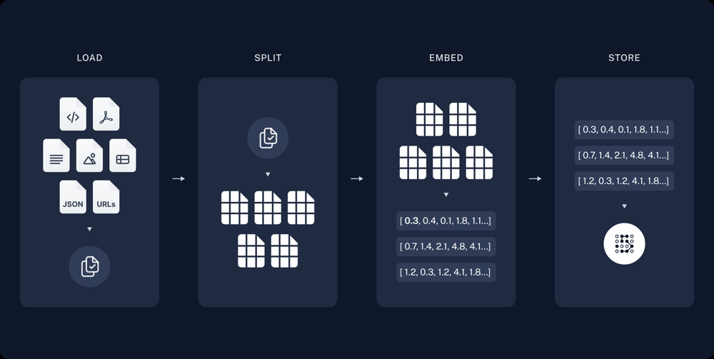
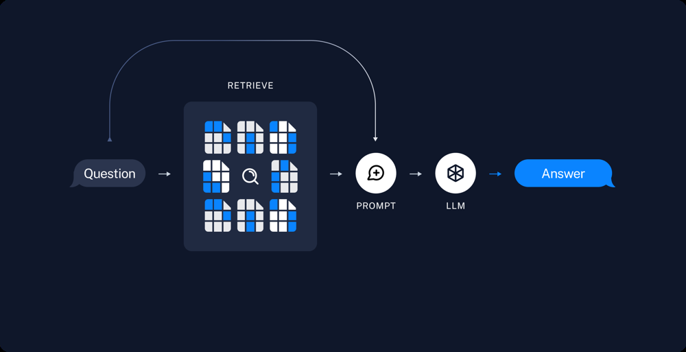

# Designing a Generative AI Finance API Assistant (LangChain & LangGraph)

(Finance-Focused Generative AI API Project Using LangChain and LangGraph)

#### Introduction:

This project is a API application that assists users with financial data analysis and Q&A using generative AI. It is designed for intermediate Python developers in the finance + technology domain. The system integrates three major components – a data ingestion pipeline, a chatbot interface, and a knowledge base – following a layered architecture similar to industry examples ([dev.to](https://dev.to/jamesli/build-an-enterprise-level-financial-data-analysis-assistant-multi-source-data-rag-system-practice-2c2h#:~:text=,be standardized into the system)). At the core, we use LangChain for large language model (LLM) capabilities (e.g. OpenAI’s GPT) and memory management, and LangGraph to orchestrate a retrieval-augmented generation (RAG) workflow. This allows the assistant to **ground its answers in real financial data** rather than relying solely on the LLM’s training knowledge ([medium.com](https://medium.com/@najamussaqib/learning-rag-with-langchains-langgraph-a-beginner-s-journey-4b9a2a5fbc08#:~:text=Retrieval,check the complete blog here)). Users can ingest and preprocess financial datasets, ask conversational questions about finance, and retrieve insights or summaries from a stored knowledge base – all through a friendly API. The codebase naturally employs a variety of Python features (data structures, concurrency, error handling, etc.) to build a robust and efficient application.


## 1. Data Pipeline for Financial Data Ingestion



<span style="color: gray;"><sub>**Figure: Typical data indexing pipeline in a RAG system:** The data pipeline ingests raw financial data from various sources and prepares it for the knowledge base. We support both **batch** jobs (e.g. a daily ETL of stock prices) and **streaming** updates (e.g. listening to a live price feed or news API). Data sources can include stock market APIs, cryptocurrency exchanges, and economic indicators. For example, LangChain’s Financial-Datasets toolkit provides access to 16,000+ stock tickers spanning 30 years via API ([python.langchain.com](https://python.langchain.com/docs/integrations/tools/financial_datasets/#:~:text=FinancialDatasets Toolkit)), which could feed our pipeline.</sub></span>
<br>
<br>
<br> 
**Ingestion and Preprocessing:** The pipeline acts as a “translator” that fetches data from different channels (CSV files, JSON APIs, web feeds, etc.) and standardizes it into a common format ([dev.to](https://dev.to/jamesli/build-an-enterprise-level-financial-data-analysis-assistant-multi-source-data-rag-system-practice-2c2h#:~:text=,be standardized into the system)). We use Python’s `requests` or websockets to retrieve data, and parse JSON or CSV responses into Python **lists** or **dictionaries** of records. To ensure data quality, the pipeline performs cleaning (handling missing values, removing duplicates using **sets**, filtering outliers) and transformations (e.g. calculating returns or technical indicators). Textual data (like financial news or reports) is cleaned for language (removing HTML, lowercasing, etc.) and split into smaller chunks if needed.

**Vectorization and Storage:** After preprocessing, relevant textual information is embedded and stored for retrieval. Using LangChain’s document loaders and text splitters, the pipeline **loads** documents or data, **splits** them into chunks, and converts each chunk into a vector embedding (using an embedding model like OpenAI or SentenceTransformers). These embeddings are then **stored** in a vector database (e.g. Chroma or FAISS) along with metadata ([python.langchain.com](https://python.langchain.com/docs/tutorials/rag/#:~:text=1,and  179 model)). This implements the “indexing” phase of RAG: raw financial data (articles, filings, etc.) is transformed into a searchable vector index for the chatbot’s knowledge base. For numeric time-series data, the pipeline could also store processed data in a relational database or CSV for direct lookup if needed, but the primary storage for QA is the vector index. The pipeline might also generate **summaries** of data (e.g. quarterly report highlights) and save them as JSON or text for quick reference.

**Implementation Notes:** The data pipeline module demonstrates several Python concepts in practice. It might use **multi-threading** (or `asyncio`) to fetch data from multiple sources or tickers concurrently, improving ingestion speed. For CPU-intensive tasks (like embedding many documents), **multi-processing** or batch processing can be used to parallelize work across cores. We leverage **context managers** (`with` statements) to manage file I/O or database connections, ensuring files and network resources are properly closed after use. A logging decorator (using Python **decorators**) can wrap pipeline functions to log execution time and progress. We use the **logging** module to record the pipeline’s steps (data fetched, records processed, errors). If an API call fails or returns unexpected data, the code handles it with **exceptions** (try/except blocks), perhaps raising a custom error or skipping that data with a warning. Python’s functional tools appear as well – for example, using **lambda functions** for quick transformations (like sorting data by date), or **itertools** to batch data into fixed-size chunks for embedding. By the end of the ingestion step, we have a cleaned dataset and a populated vector store (our knowledge index) ready to power the AI assistant ([python.langchain.com](https://python.langchain.com/docs/tutorials/rag/#:~:text=Indexing%3A a pipeline for ingesting,This usually happens offline)) ([python.langchain.com](https://python.langchain.com/docs/tutorials/rag/#:~:text=Once we've indexed our data%2C,the retrieval and generation steps)).


## 2. API Chatbot Interface (Generative AI Assistant)

The second component is a conversational **chatbot** that users interact with through the terminal. This API interface uses LangChain to integrate a large language model (LLM) for answering questions and maintaining dialogue context. Users can ask questions about finance (e.g. “What is the latest news on Bitcoin?” or “Explain Tesla’s Q2 earnings”) and get answers that are backed by the data from our pipeline. The API also accepts commands to manage the system (such as triggering a data update or retrieving a stored summary). Internally, the chatbot is implemented as a loop that reads user input, processes the query, and prints out the AI’s response.



<span style="color: gray;"><sub>**Figure: Retrieval and generation flow in a RAG-based QA system:** When the user asks a question, the assistant first **retrieves** relevant information from the knowledge base, then invokes the LLM to generate an answer incorporating that information ([python.langchain.com](https://python.langchain.com/docs/tutorials/rag/#:~:text=4,question with the retrieved data)). The API orchestrates this flow using LangChain/LangGraph, ensuring that each answer is grounded in up-to-date financial data rather than just the LLM’s static knowledge.</sub></span>
<br>
<br>
<br> 
**Generative Q&A with LangChain:** When the user asks a question, the chatbot uses LangChain’s LLM chain to generate an answer. We configure a **ChatModel** (like OpenAI’s GPT-4 via API) with a system prompt that establishes the assistant’s role (for example, “You are an AI financial analyst.”). The user’s query (and relevant retrieved data from the knowledge base, see next section) are fed into the model to produce a response. LangChain’s framework simplifies orchestrating these calls – it manages the prompt formatting and the integration of memory and tools ([github.com](https://github.com/rittmananalytics/profit_and_loss_report_analysis_chatbot#:~:text=4,a cohesive and efficient workflow)). We enable a **conversation memory** module so the chatbot can remember previous interactions in the session. For instance, using LangChain’s `ConversationBufferMemory` (or the newer LangGraph memory integration), the assistant retains the dialogue history, allowing follow-up questions to be understood in context (e.g. “What about Apple’s revenue?” referring to the prior topic of Apple). This memory could be stored in a Python **list** of tuples (user message, assistant reply) behind the scenes, or a deque from **collections** to cap the length (for a windowed memory). LangChain (and LangGraph) handle the injection of this memory into the prompt, so earlier Q&A are recalled as needed.

**Command-Line Interaction:** The API supports a few modes: (a) running the data pipeline job, (b) interactive Q&A chat, and (c) fetching knowledge base info or summaries. We can implement a simple text-based menu or use argument flags (via `argparse` or `click`). For example, a user might run `finance_gpt.py --ingest data.yaml` to load data, or start the app without arguments to enter chat mode. In chat mode, special commands like `:refresh` could trigger a background data update, or `:summaries` could display a list of stored summary insights (for example, “Latest GDP figure: ...”). The API design ensures these commands are parsed and routed to the appropriate functions. We might maintain a dictionary of command handlers (mapping command strings to functions), using a **decorator** to easily register new commands. This demonstrates use of function **arguments** (including the asterisk `*` operator for variable arguments in commands). The chatbot loop uses string operations to parse user input (since everything is input as text) – e.g. splitting on spaces, or detecting keywords (this showcases Python **string** handling).

**Robustness and Logging:** Throughout the chat interaction, the code is resilient to errors. We use try/except to catch issues like a network timeout from the LLM API or an unknown command from the user, then print friendly error messages instead of crashing. The chatbot also logs each query and response (using the logging module) to a file or console, which can help in auditing and debugging conversations. This logged conversation can also serve as a knowledge source to further fine-tune the assistant (future improvement). Overall, the API component ties together the user experience, calling the data pipeline when needed and leveraging the knowledge base to answer questions.


## 3. Knowledge Base and RAG Workflow (LangGraph Integration)

The knowledge base is the heart of this project’s “intelligence.” It consists of the vector-indexed data and the logic to retrieve and utilize that data for answering questions – following a **retriever-augmented generation (RAG)** approach. In RAG, the system searches an external knowledge repository for facts to ground the LLM’s response ([medium.com](https://medium.com/@najamussaqib/learning-rag-with-langchains-langgraph-a-beginner-s-journey-4b9a2a5fbc08#:~:text=Retrieval,check the complete blog here)). Here, our repository is the vector store built from financial data (stock prices, news articles, reports, etc.). We use **LangGraph** (an extension of LangChain) to define a retrieval+generation graph, which makes the QA process modular and maintainable.

**Retriever-Augmented Generation Flow:** The query workflow runs as follows: given a user’s question, the system creates an embedding of the question (using the same embedding model as the index) and performs a similarity search in the vector database. Using LangChain’s **Retriever** interface, we fetch the top relevant document chunks or data points that might contain the answer ([python.langchain.com](https://python.langchain.com/docs/tutorials/rag/#:~:text=4,question with the retrieved data)). For example, if the question is “What is the P/E ratio of Company X?”, the retriever might find a stored snippet from Company X’s latest financial report or a precomputed summary of key metrics. These retrieved pieces of context are then fed, along with the user’s question, into the LLM prompt. The LLM (via LangChain’s chain) generates a final answer that cites or incorporates the retrieved facts. LangGraph helps orchestrate this multi-step process as a graph of nodes (one node for retrieval, one for the LLM call, etc.), making it easy to add branching logic or additional steps if needed ([python.langchain.com](https://python.langchain.com/docs/tutorials/rag/#:~:text=Once we've indexed our data%2C,the retrieval and generation steps)). For instance, we could add a node that, if the initial answer is uncertain, triggers a refinement step or uses a second model to double-check (advanced feature). The LangGraph-based design also supports more complex agent behaviors: e.g., the assistant could decide to **skip retrieval** if the question is something the LLM can answer directly from its own knowledge (like a general question about finance theory), as demonstrated by a similar LangChain/LangGraph chatbot template ([github.com](https://github.com/mayooear/ai-pdf-chatbot-langchain#:~:text=,server to the client UI)).

**Managing the Knowledge Base:** The vector store (our knowledge index) can be implemented with an open-source solution like **ChromaDB** or FAISS for local use, or a cloud vector DB (Pinecone, Weaviate) for scalability. Each entry in the store has the vector embedding and metadata (e.g. source name, date, perhaps a short text summary). We use this metadata to provide source citations or filter results (for example, only retrieve recent data for questions about “latest” info). The RAG system can also incorporate a **knowledge freshness** mechanism: if data is outdated or missing for a query, the assistant can acknowledge this or even invoke a pipeline update (e.g. “No recent data on that topic; would you like to fetch the latest?”). We ensure that adding new data (via the pipeline) updates the vector index accordingly – LangChain provides utilities to append or re-index new documents on the fly.

**LangChain & LangGraph Integration:** Under the hood, LangChain serves as the glue managing the LLM and retrieval components, and LangGraph provides a structured way to define the flow. LangChain’s role includes handling the agent’s memory and tool use, ensuring a cohesive workflow ([github.com](https://github.com/rittmananalytics/profit_and_loss_report_analysis_chatbot#:~:text=4,a cohesive and efficient workflow)). LangGraph allows our QA chain to be defined declaratively as a graph, which is useful for visualizing and modifying the RAG workflow. (For example, LangGraphRAG – an open-source terminal RAG system – uses a similar approach of routing queries through history caching, query transforms, and vector searches ([github.com](https://github.com/ranguy9304/LangGraphRAG#:~:text=LangGraphRAG)).) Our project’s knowledge module effectively implements a specialized **finance Q&A chain**: it might include custom logic such as converting numerical answers into nicely formatted strings (e.g. adding dollar signs or percentage formatting) or performing simple calculations on retrieved data (like year-over-year comparisons) before final answer crafting. These steps would use Python’s capabilities (e.g. a small **generator** function to stream out a long answer in parts, or using decimal module for precise financial calcs) integrated into the LangGraph nodes.

**Context and Memory:** The knowledge base works hand-in-hand with the chatbot’s memory. The retriever can be augmented to consider the conversation context – for example, if the previous user question was about a specific stock, the next question’s retrieval can prioritize that stock’s data unless the query indicates otherwise. LangChain’s memory state (past chat history) can be fed as additional context to the RAG pipeline so that follow-up questions are answered in continuity. This creates a more natural, conversational experience for the user, where the assistant can do things like first retrieve a company’s report when asked “Tell me about Company Y’s performance,” and then when the user asks “How about its last quarter profit?”, the assistant recalls that “Company Y” is the topic and uses the same knowledge base context to answer.

In summary, the knowledge base component ensures the API assistant has **up-to-date, factual grounding**. By combining vector search with LLM reasoning, we mitigate the hallucination problem and make the answers credible. This design is in line with modern AI assistant architectures for finance – for instance, one case study built a multi-source financial analysis assistant that combines historical data and real-time information in a RAG engine ([dev.to](https://dev.to/jamesli/build-an-enterprise-level-financial-data-analysis-assistant-multi-source-data-rag-system-practice-2c2h#:~:text=,to integrate new analysis models)). Our project leverages that same powerful idea: use **data + AI** together. LangGraph’s RAG template lets us implement this cleanly, and we can expand it with additional tools over time (e.g. an external API call agent for live stock prices, or an SQL query agent if we integrate a financial database) to enhance the system’s capabilities.


## 4. Key Python Techniques and Features Utilized

One goal of this project is to demonstrate idiomatic use of intermediate-level Python features in a realistic application. Rather than artificial examples, these concepts appear naturally throughout the codebase:

- **Core Data Structures:** We use Python **lists, tuples, dictionaries, and sets** extensively. For example, lists store collections of records (like a list of price data points or a chat message history), tuples might represent immutable pairs (e.g. a date and price), dictionaries map keys to values (like a config mapping command names to functions, or ticker symbols to data), and sets help eliminate duplicate entries (e.g. unique identifiers for data sources). This ensures efficient data manipulation and lookups during pipeline processing and QA retrieval.
- **Collections & Itertools:** The project may leverage utilities from the **`collections`** module (such as `deque` for an efficient sliding window of recent messages in memory, or `defaultdict`/`Counter` to aggregate data by category) and **`itertools`** (for example, using `itertools.islice` or `grouper` patterns to batch-process chunks of data, or chain iterators from multiple sources). These help handle streaming data and complex iteration in the pipeline.
- **String Handling:** Since the application deals with a lot of text (financial news, report text, user queries, etc.), we make heavy use of Python **string** operations. This includes parsing and cleaning text (splitting lines, replacing or regex for removing symbols), formatting output with f-strings (for nicely formatted answers or logs), and building prompts for the LLM with dynamic content.
- **Lambda Functions and Functional Patterns:** Small **lambda** functions appear in scenarios like sorting retrieved results by relevance score (`results.sort(key=lambda x: x.score)`) or filtering data (`filter(lambda rec: rec['value'] is not None, records)`). We also utilize Python’s built-in higher-order functions (`map`, `filter`, `any`, `all`) when it leads to cleaner data processing logic.
- **Error Handling:** The codebase is designed with robust **exception handling**. We define custom exception classes for critical errors (for instance, a `DataIngestionError` if the pipeline fails, or a `QueryHandlingError` for issues during QA). Try/except blocks wrap external calls (API requests, file I/O, model invocations) to catch errors and either recover (retry or use fallback) or log and gracefully inform the user. This prevents crashes and ensures a smooth user experience.
- **Logging:** We integrate Python’s **`logging`** module to trace the system’s behavior. There are logging statements for key events like “Data fetch started for XYZ”, “Vector store updated with N items”, “User asked question X”, etc. Logs are written to a file (and optionally printed to console in debug mode) with timestamps and severity levels. This not only helps in debugging but also provides transparency – users or developers can audit what data was used to answer a question, enhancing trust.
- **JSON and Configuration Handling:** Configuration for the app (API keys, file paths, vector DB settings) is managed using JSON or YAML config files. We use Python’s **JSON** library to read/write such configs or to cache certain results. For example, after data ingestion, we might dump a JSON summary of key stats to disk, which can be quickly loaded when the user asks for a summary. The chatbot might also save conversation transcripts as JSON. This demonstrates file I/O and serialization in a practical context.
- **Decorators:** The project uses Python **decorators** to add common functionality in a clean way. For instance, we might write a `@timer` decorator to measure execution time of functions (logging how long the data ingestion took). Another decorator `@command(name)` could be used to register API commands to a central dispatch table, as mentioned earlier. This shows how decorators can enhance code modularity and reuse without repetitive boilerplate.
- **Generators:** To handle streaming data and large datasets efficiently, we employ **generator** functions (using `yield`). For example, the data pipeline might implement a generator that yields one cleaned record at a time, allowing us to start processing or indexing data before the entire dataset is loaded (useful for large data or real-time feeds). Similarly, if we implement streaming responses (so the user sees the answer being generated token by token), we could use a generator to yield partial LLM outputs as they arrive. Generators provide memory efficiency and enable pipeline streaming.
- **Concurrency (Multi-threading and Multi-processing):** Both **threads and processes** are utilized to improve performance. Multi-threading (via Python’s `threading` or `concurrent.futures.ThreadPoolExecutor`) is ideal for I/O-bound tasks – e.g. fetching data from multiple APIs in parallel, or handling multiple user queries concurrently (if we ever allow concurrent sessions). We ensure to use thread-safe practices (like locks or queues) if threads share data (for example, a thread-safe queue could collect data fetched by worker threads). Multi-processing (using `multiprocessing` or `ProcessPoolExecutor`) comes into play for CPU-bound work, such as embedding a large number of documents or running a heavy data transformation on big datasets. By distributing work across processes, we bypass the GIL for those tasks, utilizing multiple CPU cores for speed. The design carefully manages these processes (graceful shutdown, avoiding zombie processes) possibly with context managers (e.g. using `with ProcessPoolExecutor() as pool:`) for safety.
- **Function Arguments and Asterisk Operator:** We follow Python best practices for flexible function interfaces. Some functions accept optional arguments and use default values or the **`\*args` and `\**kwargs`** syntax to forward parameters. For example, a function `update_data(*symbols, force=False)` might take an arbitrary list of stock symbols to update, demonstrating variable-length positional arguments. We also use the asterisk operator for unpacking containers – for instance, unpacking a tuple of (args, kwargs) when calling a stored command, or merging two dictionaries of settings with `{**dict1, **dict2}` for convenience. This makes the code more general-purpose and extensible.

Each of these Python features is employed in service of building a maintainable, efficient finance AI application. We do not explain these concepts in isolation; instead, they reveal themselves as natural parts of the implementation (as would be expected in a production codebase). This provides intermediate developers with a rich reference of how to apply core Python skills in an AI-powered project.


## 5. Similar Projects and References

To validate our design choices and draw inspiration, we explored public projects and resources that combine LangChain/LangGraph with finance or data pipelines. Below is a selection of similar implementations and references:

- **LangGraphRAG (GitHub)** – *A terminal-based Retrieval-Augmented Generation system using LangGraph.* This open-source project routes user queries through history caching, query transformation, and vector database retrieval to produce answers ([github.com](https://github.com/ranguy9304/LangGraphRAG#:~:text=LangGraphRAG)). It demonstrates a API RAG architecture similar to our knowledge base + chatbot design.
- **Financial Chat (GitHub)** – *A finance chat application using LangChain, LangGraph, OpenBB, and more.* This project by Seth Hobson provides an AI stock analysis assistant that fetches real market data (via OpenBB and other APIs) and uses multiple agent workflows orchestrated with LangGraph ([github.com](https://github.com/wshobson/financial-chat#:~:text=A financial chat application powered,Claude 3 Opus%2C and Streamlit)). It features tools for technical analysis, sentiment on news, and memory, showcasing an advanced version of a finance chatbot. (See the blog series linked in its README for a deep-dive into its architecture.)
- **Financial Agent (GitHub)** – *A LangChain-based financial agent with FastAPI.* An example of an AI agent that can retrieve current/historical stock prices, news, and compute financial metrics (like P/E, ROE) via Polygon.io API ([github.com](https://github.com/virattt/financial-agent#:~:text=Financial Agent)). It’s not API-based (it has an API/Playground UI), but it illustrates how LangChain can be used to build a finance-focused assistant with tool usage for data lookup and calculations (e.g. performing DCF valuations).
- **AI PDF Chatbot with LangChain/LangGraph (GitHub)** – This template project ingests documents (PDFs), stores their embeddings in a vector DB, and answers questions with an LLM ([github.com](https://github.com/mayooear/ai-pdf-chatbot-langchain#:~:text=This monorepo is a customizable,and LangGraph as orchestration frameworks)). It uses LangGraph to orchestrate the retrieval vs. direct answer decision and streams answers to a UI. While not finance-specific, it closely parallels our design’s RAG workflow (with a “document ingestion graph” and a “retrieval graph” for Q&A) ([github.com](https://github.com/mayooear/ai-pdf-chatbot-langchain#:~:text=,server to the client UI)). It’s a good reference for implementing RAG with LangChain and LangGraph in Python.
- **Enterprise Financial Data RAG System (Blog)** – *Multi-source Financial Assistant with LangChain.* James Li’s article describes building an enterprise-level financial analysis assistant using a three-layer design (data ingestion, RAG analysis, presentation) ([dev.to](https://dev.to/jamesli/build-an-enterprise-level-financial-data-analysis-assistant-multi-source-data-rag-system-practice-2c2h#:~:text=,to integrate new analysis models)) ([dev.to](https://dev.to/jamesli/build-an-enterprise-level-financial-data-analysis-assistant-multi-source-data-rag-system-practice-2c2h#:~:text=,conclusion goes through multiple verifications)). It emphasizes real-time data ingestion, parallel processing of analysis tasks, and converting complex data into user-friendly answers. Our project follows the same fundamental ideas on a smaller scale, and this reference provides architectural guidance and best practices (like token management and streaming responses for low latency).

Each of these resources provided insight into building powerful AI-driven finance applications. By combining their approaches with the requirements at hand, we crafted a project blueprint that is up-to-date and grounded in proven techniques ([python.langchain.com](https://python.langchain.com/docs/tutorials/rag/#:~:text=A typical RAG application has,two main components)). The result is a comprehensive CLI tool where a robust data pipeline, an intelligent chatbot, and an efficient RAG-based knowledge base all come together – empowering users to navigate financial data and get answers with the help of generative AI.


## 6. Project Prospectus


### a. Components

#### i. Data Pipeline
- **Objective:** Ingest, preprocess, and index financial datasets.
- **Sources:** Stock market APIs, cryptocurrency exchanges, economic indicators.
- **Processing Steps:**
  - Fetch data (CSV, JSON, APIs).
  - Clean data (remove duplicates with sets, handle missing values).
  - Transform data (calculate returns, technical indicators).
  - Vectorize textual data and store embeddings in a vector DB (Chroma, FAISS).
- **Technologies:** Multi-threading, Multi-processing, Logging, JSON handling, Context Managers.

#### ii. API Chatbot Interface
- **Objective:** Provide interactive, conversational Q&A powered by Generative AI.
- **Features:**
  - Interactive API-based chat interface.
  - Conversational memory via LangChain.
  - User commands for data updates and summaries.
- **Technologies:** Decorators for commands, Exceptions for robust error handling, Logging interactions.

#### iii. Knowledge Base (RAG with LangGraph)
- **Objective:** Enable contextually accurate retrieval and responses through a vector-indexed knowledge base.
- **Workflow:**
  - User queries converted to embeddings.
  - Retrieve relevant document chunks.
  - Generate responses using retrieved data with LangGraph orchestration.
- **Technologies:** Generators for streaming responses, Python collections, itertools for efficient data handling.


### b. API Usage Examples

- Run data ingestion:
```
python finance_gpt.py --ingest data.yaml
```

- Start interactive chat:
```
python finance_gpt.py
```

- Execute commands:
```
:refresh  # Update data
:summaries  # Display stored summaries
```
